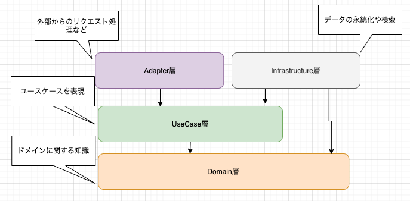
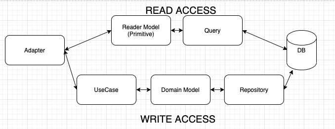
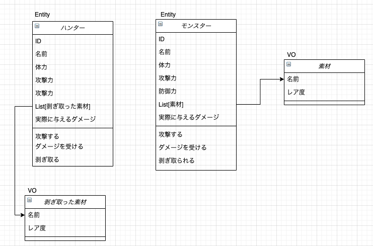
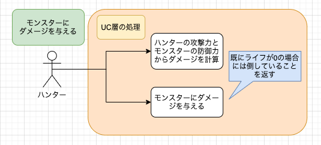
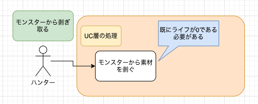
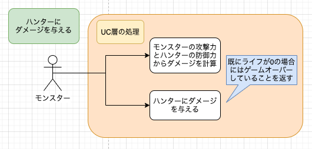

:warning: 注意 :warning:

ディレクトリ構成などはオレオレ流でありGolang Wayには全く則っていません。
以下などを参考にしてください。

https://github.com/golang-standards/project-layout

---

# DDD on Golang Sample
- [yu-croco/ddd_on_scala_sample](https://github.com/yu-croco/ddd_on_scala_sample) のGolangバージョン
- Golang（Gin）を使い、なんちゃってモンハンの世界をDomain-Driven Designで実装している
- アーキテクチャとしてのサンプルのため、ORM(Gorm)の使い方は割と適当...
- Scala版とGolang版を実装してみての比較まとめはこちら: [ScalaとGolangでDDDを実装比較してみた](https://zenn.dev/nameless_gyoza/articles/e30d9e1283ab5b9576ff)

## 技術スタック
- Golang: v1.15
- Go modules
- Gin: v1.6.3
- Gorm: v1.9.16
- Docker: 19.03.12
- docker-compose: 1.26.2

## 構成
### 全体
アプリケーション全体としては以下の構成となっており、いわゆるオニオンアーキテクチャの形式である。


読み取りアクセス（GET）と書き込みアクセス（POST/PUT/DELETE）では処理フローを以下のように分けている（CQRS）。



### app配下の構成
ドメインで使用するモデルはdomain配下に、DBとのアクセスで使用するモデルはDAOとしてinfrastructure配下にそれぞれ配置した。
同じような構成を2箇所で記述するのでコード量は増えるが、これによってDomain層のロジックが他の層に漏れ出すことを防げる。

```
pkg/
├── adapter // 外部からのリクエスト処理
│   └── controller
├── domain // ドメイン関連の処理
│   ├── model
│   ├── repository
│   └── service
├── errors // アプリケーション全体のエラー処理
│   └── error.go
├── infrastructure // DBアクセス処理
│   ├── dao
│   ├── db.go
│   ├── queryImpl
│   ├── repositoryImpl
│   └── seeds
├── query // query processor
│   ├── hunterQuery.go
│   └── monsterQuery.go
└── usecase // usecase(application)
    ├── hunter
    └── monster
```

## ドメインモデル図
このレポジトリで扱っているドメインモデル図は以下の通り。


## ユースケース図

### ハンター主体のケース
- ハンターがモンスターを攻撃する
    - 確認コマンド: `make attack_monster`



- ハンターが倒したモンスターから素材を剥ぎ取る
    - 確認コマンド: `make get_material_frommonster`



### モンスター主体のケース
- モンスターがハンターを攻撃する
    - 確認コマンド: `make attack_hunter`



## セットアップ
- このレポジトリをgit cloneする
- `docker-compose up`でAPIサーバーとDBが起動する
    - seedデータも投入される
- Makefileにアクセス処理が入っているので、叩いて動作確認ができる

## 実装してみての考察
Golangを用いてDDDをどこまでできたのか（できそうか）をまとめている。
前提として「一般的にDDDに向いていると言われているScalaで実装したものをGolangでもやってみた」というものであり、両者のパラダイムが異なることはある程度理解している。

### 意味のあると感じたこと
- 階層/パッケージ分けにより責任の所在をある程度まとめられる
  - DDDというよりはオニオンアーキテクチャなどの観点かもしれないが、関心事の分離はアプリケーションの基本であると思うので重要なことに変わりはない
- Repository層でのDI
  - interfaceとstructの組み合わせによるDIは、当初想定していた以上にキレイに実装できる感じだったので良かった
    - mockを使ったテストなどはしていないので、その点では未知数(たぶんうまくいける)

### 辛み
- Genericを使った共通処理が作れないため記述量が増える
    - implicit classが恋しい
    - そもそも言語パラダイム的に兼ね備えていないので文句を言う方が不適切な気もするが...
- パッケージ構成に慣れが必要
    - `import cycle not allowed` で怒られる...

## DDDらしさを引き出すためのTips
### 完全コンストラクタ
Value Objectが何らかの存在条件を持っている場合（例えば `UserNameは5文字以上20文字以下のStringであること` など）には条件を満たないValue Objectの生成を防ぐために、Value Objectを生成する際に `必ず成功or失敗のどちらかとなる` ファクトリメソッドを用意すると便利（完全コンストラクタの実現）このレポジトリでは試験的にhunterId/monsterIdにその機能を取り入れた（それら以外のValue Objectは特別な条件を有していないため省略）。

懸念点としては、完全コンストラクタを採用したいオブジェクトが増えると記述するコード量が確実に増えることである。Scalaの型パラメータのように型を抽象化して共通化できないので、基盤の共通化が難しそうである。

```go
// Domain層で完全コンストラクタのための初期化処理を記述
func NewHunterId(id int) (*HunterId, *errors.AppError) {
	if id <= 0 {
		err := errors.NewAppError("HunterIdは1以上の値にしてください")
		return nil, &err
	}

	hunterId := HunterId(id)
	return &hunterId, nil
}

// Adapter層で使用する
func (ctrl HunterAttackController) Update(c *gin.Context) {
	var monster model.Monster
	c.BindJSON(&monster)

	hunterId, hunterIdErr := model.NewHunterId(helpers.ConvertToInt(c.Param("id")))
	if hunterIdErr.HasErrors() {
		helpers.Response(c, nil, hunterIdErr)
	} else {
		result, errs := hunter.AttackMonsterUseCase(*hunterId, monster.Id)
		helpers.Response(c, result, errs)
	}
}
```

### interfaceを使ったDI
インターフェイスと実装を分ける手段として、RepositoryではDIコンテナが使用されることが一般的であると思う。GinではDIコンテナが提供されていないので、今回は自作している。
調べた範囲では以下のようなやり方が一般的のようである。インターフェイスとして持たせたい処理をinterfaceに記載し、それをstructに持たせることで実装を強制することができる。

```go
// インターフェイス
type MonsterRepository interface {
	FindById(id int) (*model.Monster, *errors.AppError)
}

// 以下、具体的な実装
type MonsterRepositoryImpl struct{}

func NewMonsterRepositoryImpl() repository.MonsterRepository {
	return &MonsterRepositoryImpl{}
}

func (repositoryImpl *MonsterRepositoryImpl) FindById(id int) (*model.Monster, *errors.AppError) {
	db := infrastructure.GetDB()
	var err errors.AppError
	monsterDao := dao.Monster{}

	if db.First(&monsterDao, dao.Monster{ID: uint(id)}).RecordNotFound() {
		err = notFoundMonsterError(id)
		return nil, &err
	}

	return monsterDao.ConvertToModel(), nil
}
```

### エラーの積み上げ
Adapter層では1つのリクエスト処理に対して複数エラーが発生することがある（userNameとpasswordでそれぞれ何らかのエラーが発生した、など）。
そういったケースに向けて、エラーを積み上げられるようにしておくと良いと思う。

```go
type AppError struct {
	Errors []string `json:"errors"`
}

func NewAppError(message string) AppError {
	var errorResult []string

	err := errors.New(message)
	errorResult = append(errorResult, err.Error())

	return AppError{Errors: errorResult}
}

func (appErr *AppError) Concat(other AppError) AppError {
	len := len(appErr.Errors) + len(other.Errors)
	errors := make([]string, len)

	errors = append(append(errors, appErr.Errors...), other.Errors...)

	return newAppErrors(errors)
}

func newAppErrors(messages []string) AppError {
	return AppError{Errors: messages}
}

func main() {
    err1 := NewAppError("ユーザー名は5文字以上20文字以内で記載してください")
    err2 := NewAppError("パスワードは8文字以上30文字以内で記載してください")
    
    erros := err1.Concat(err2)

    // これをresponseで返すと以下の感じになる
    // {
    //   "errors": [
    //     "ユーザー名は5文字以上20文字以内で記載してください",
    //     "パスワードは8文字以上30文字以内で記載してください"
    //   ]
    // }
}
```

## 参考
- [Clean Architecture in Go](https://medium.com/@hatajoe/clean-architecture-in-go-4030f11ec1b1)
- [Practical Persistence in Go: Organising Database Access](https://www.alexedwards.net/blog/organising-database-access)
- [今すぐ「レイヤードアーキテクチャ+DDD」を理解しよう。（golang）](https://qiita.com/tono-maron/items/345c433b86f74d314c8d)
- [pospomeのサーバサイドアーキテクチャ3](https://booth.pm/ja/items/1578182)
- [GOのORMを分かりやすくまとめてみた【GORM公式ドキュメントの焼き回し】](https://qiita.com/gold-kou/items/45a95d61d253184b0f33)
- [Gin と GORM で作るオレオレ構成 API](https://qiita.com/Asuforce/items/0bde8cabb30ac094fcb4#controller-%E3%81%AB-action-%E3%82%92%E5%AE%9F%E8%A3%85%E3%81%99%E3%82%8B)
